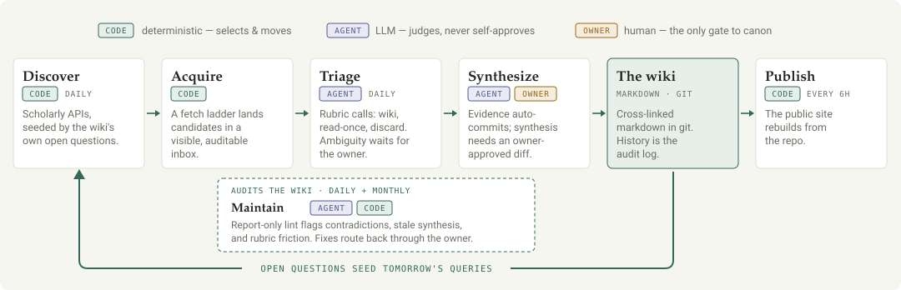

# llm-research-wiki

A public research wiki about how AI is changing work — jobs, tasks, skills, teams, organizations,
and how any of those changes can actually be measured — through the lens of
**industrial–organizational (I-O) psychology**, the science of people at work.

The central question:

> How does AI change work, workers, jobs, organizations, and measurement — and what does I-O
> psychology help us understand, evaluate, and design better?

The wiki holds two kinds of pages: **topics** (synthesis pages, each built around one question —
what the evidence says, where studies agree or contradict, and what remains unresolved) and
**sources** (one page per paper or report: citation, summary, key claims, and limitations). Every
claim on a topic page links back to the sources behind it. Read it live at
**[nbremner.github.io/ai-workforce-transformation-wiki](https://nbremner.github.io/ai-workforce-transformation-wiki/)**.

Pages are drafted with the help of a large language model and reviewed before they become part of
the wiki. Treat it as a map of the literature, not a substitute for it — verify claims against the
original sources before citing them.

## How it runs

<picture>
  <source media="(prefers-color-scheme: dark)" srcset="docs/assets/wiki-architecture-dark.svg">
  
</picture>

<sub>Diagram source lives in `docs/assets/`; interactive HTML versions in `docs/`.</sub>

## The repo

This repo is the **single source of truth**: it holds both the wiki content (`wiki/`: topics,
sources, and the `schema.md` contract) and the machinery that operates it (skills, scripts, tests,
operating docs). The only thing kept outside git is the raw-PDF corpus in Google Drive.

For agents working in this repo: read `OPERATING_MODEL.md` for the architecture and `AGENTS.md` for
the contribution rules and hard boundary. The live contract read at action time is `wiki/schema.md`.

## What belongs here

- The wiki itself under `wiki/` (`schema.md`, `overview.md`, `topics/`, `sources/`)
- Hermes skill markdown files for the research-wiki workflows
- Durable Python scripts used to triage or prepare research-wiki inputs
- Operating-layer documentation and the architecture model
- Non-secret configuration examples and lightweight guardrail tests

## What does not belong here

- Research PDFs or document corpora (those live in Google Drive)
- Google Drive inventories, generated backlog CSVs, JSONL run outputs, downloads, or caches
- Hermes sessions, memories, state databases, auth files, logs, or credentials
- API tokens, OAuth refresh tokens, `.env` files, or private runtime state

The raw-PDF corpus lives in Google Drive; everything else — content and machinery — lives here.

## Current contents

```text
wiki/                       # the wiki: schema.md (contract), overview.md, topics/, sources/
OPERATING_MODEL.md          # canonical architecture — substrate, roles, loop, deployment, cron
AGENTS.md                   # repo contribution rules + hard boundary

skills/
  research-wiki-ingest/
  research-wiki-graph-lint/
  research-scan-triage/
  research-wiki-query/

scripts/
  research-wiki-tools/
    graph_lint.py
    research_scan.py           # deterministic scan harness (discovery -> acquisition -> rank)
    scan_triage_apply.py       # applies triage dispositions (Drive moves, manifest, digest)
    scan_common.py             # shared scan machinery
    scan_config.py             # editable scan rubric/config

docs/
  wiki-redesign-plan.md        # the build plan for the markdown-in-git wiki
  research-scrape-plan.md      # the build plan for the research-scan front end
  wiki-architecture-visual.html       # architecture diagram (horizontal strip, embeddable)
  wiki-architecture-visual-full.html  # architecture explainer (long form)
  assets/                      # README diagram SVGs (light + dark)

config/
  example.env

tests/
  test_graph_lint.py
  test_research_scan.py
  test_scan_triage_apply.py
  test_spine_guardrails.py
```

## Basic usage

The scripts run from a configured agent machine with Google Drive OAuth already available. They do not contain credentials.

```bash
python scripts/research-wiki-tools/graph_lint.py                       # lint the wiki graph
uv run scripts/research-wiki-tools/research_scan.py --queries 3 --no-acquire   # scan smoke (local)
uv run scripts/research-wiki-tools/research_scan.py --drive                    # full scan to Drive _triage
uv run scripts/research-wiki-tools/scan_triage_apply.py --latest --dispositions d.json  # triage dry run
python -m pytest tests/ -q                                             # run the test suite before committing
```

## Boundary

This repo holds the wiki content and its machinery. If a file is an artifact of a specific research scan, a PDF processing run, or a Drive state snapshot, it does not belong here.
